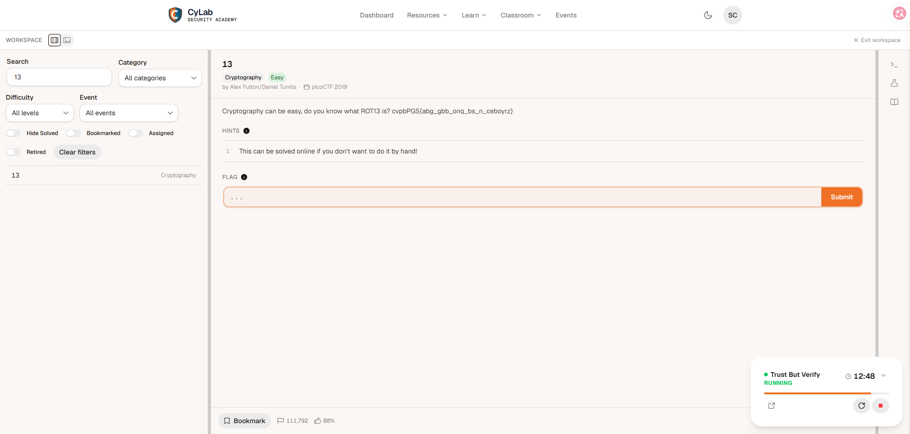
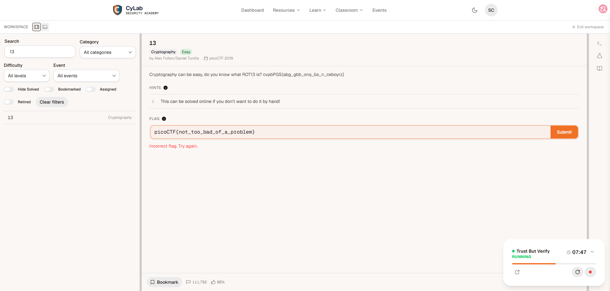
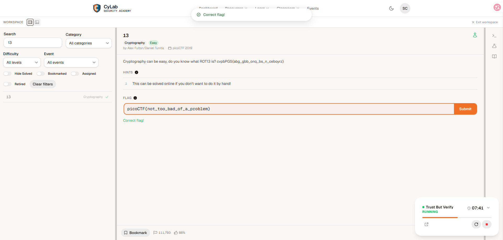
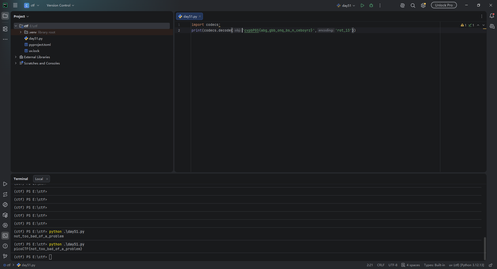

# Category - Cryptography
# Author - Joshbitcode

**Description**

Cryptography can be easy, do you know what ROT13 is? cvpbPGS{abg_gbb_onq_bs_n_ceboyrz}

# Solution

This is day 51 of my security learning. I picked "13" from the Cryptography category as my first picoGym challenge of this session. The description gives the game away: it asks whether you know what ROT13 is and hands you a ciphertext that already looks like a flag with the letters shifted. The challenge name itself is the hint — 13 is ROT13.

ROT13 rotates each letter 13 places forward (A→N, B→O, …), and because the alphabet has 26 letters, applying it a second time returns the original text. That symmetry is convenient: the same operation encrypts and decrypts, so there is nothing to reverse-engineer.

I keep a small decoder script in my practice folder from earlier learning, so I just ran it from `E:\ctf`:

```
(ctf) PS E:\ctf> python .\day51.py
picoCTF{not_too_bad_of_a_problem}
```









What made this one feel simple to me is that the ciphertext keeps the `picoCTF{...}` shape intact — curly braces, underscores, and all — and only the letters are shifted. That pattern is exactly what ROT13 does, since it only touches A–Z and a–z and leaves punctuation alone. I found the whole thing straightforward, and honestly it made me more interested in CTF — I want to keep going and try harder problems after this.

The defensive takeaway I wrote down for myself: ROT13 is a reversible encoding, not encryption. Anything "protected" this way is just obfuscated, and anyone can undo it in one command — real systems need real cryptography, not alphabet rotation.

# Flag

```
picoCTF{not_too_bad_of_a_problem}
```

# Time spent

Time | Date
---|---
~6m | 8/17/26
