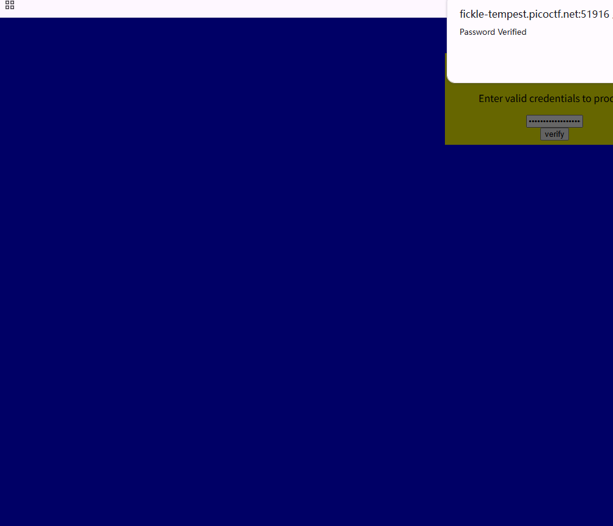

# Category - Web Exploitation
# Author - Joshbitcode

**Description**

Can you break into this super secure portal? [instance link from the challenge page]

# Solution

The challenge serves a "super secure portal" with a password box. The first thing I did was look at what the page actually sends and checks — and the source code answers that immediately: the entire password verification happens in client-side JavaScript. The page calls a `verify()` function that slices the password into 4-character chunks and compares each chunk to a constant, but **out of order**:

```javascript
<script type="text/javascript">
  function verify() {
    checkpass = document.getElementById("pass").value;
    split = 4;
    if (checkpass.substring(0, split) == 'pico') {
      if (checkpass.substring(split*6, split*7) == 'eb02') {
        if (checkpass.substring(split, split*2) == 'CTF{') {
         if (checkpass.substring(split*4, split*5) == 'ts_p') {
          if (checkpass.substring(split*3, split*4) == 'lien') {
            if (checkpass.substring(split*5, split*6) == 'lz_2') {
              if (checkpass.substring(split*2, split*3) == 'no_c') {
                if (checkpass.substring(split*7, split*8) == 'b45}') {
                  alert("Password Verified")
                  }
                }
              }

            }
          }
        }
      }
    }
    else {
      alert("Incorrect password");
    }
</script>
```

So the "secret" password is sitting right there in the page, just shuffled. All I had to do was collect the chunks and reorder them by their position index: `pico` + `CTF{` + `no_c` + `lien` + `ts_p` + `lz_2` + `eb02` + `b45}`, which gives the flag directly.




The takeaway I wrote down for myself: client-side checks are not security. Anything the browser can see, the user can see, and any "secret" embedded in the page is public. Real authentication and authorization have to live on the server — the client is only allowed to *suggest* what it wants.

# Flag

```
picoCTF{no_clients_plz_2eb02b45}
```

# Time spent

Time | Date
---|---
~4m | 8/17/26
