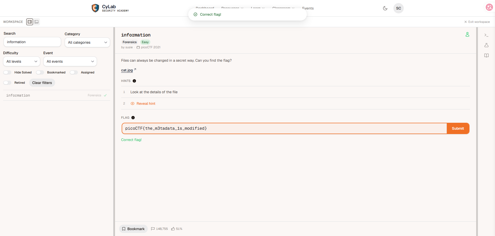

# Category - Forensics
# Author - Joshbitcode

**Description**

Files can always be changed in a secret way. Can you find the flag? (attachment: cat.jpg)

# Solution

The challenge gives you a picture of a cat and one sentence about files being "changed in a secret way". The first thing that comes to mind with a JPEG is metadata — the extra information files carry around without showing it. So the plan was: open the image, read its metadata, and look for anything that does not belong there.

I wrote a small script that opens the image with PIL, pulls the XMP block out of `img.info`, and searches it for a Base64-looking string in the `cc:license` field:

```python
#!/usr/bin/env python3
"""
picoCTF 2021 - information (Forensics)
Extract and decode the flag from the XMP metadata of cat.jpg
"""

from PIL import Image
import base64
import re


def extract_flag(image_path: str) -> str:
    img = Image.open(image_path)

    # 1. Get XMP data directly from img.info
    xmp_data = img.info.get("xmp", b"")
    if isinstance(xmp_data, bytes):
        xmp_str = xmp_data.decode("utf-8", errors="ignore")
    else:
        xmp_str = str(xmp_data)

    # 2. Extract the Base64 string from the cc:license field using regex
    # Example: <cc:license rdf:resource='cGljb0NURnt0aGVfbTN0YWRhdGFfMXNfbW9kaWZpZWR9'/>
    match = re.search(r"cc:license[^>]*resource=['\"]([A-Za-z0-9+/=]+)['\"]", xmp_str)

    if not match:
        # Fallback: search for any long Base64-looking string in the XMP
        match = re.search(r"([A-Za-z0-9+/]{30,}={0,2})", xmp_str)

    if not match:
        raise ValueError("Base64-encoded license field not found")

    b64_str = match.group(1)
    print(f"[+] Found Base64: {b64_str}")

    # 3. Decode it
    flag = base64.b64decode(b64_str).decode("utf-8")
    return flag


if __name__ == "__main__":
    image_path = "cat.jpg"  # Change this path if needed
    try:
        flag = extract_flag(image_path)
        print(f"\n[+] Flag: {flag}")
    except Exception as e:
        print(f"[-] Error: {e}")
```

Running it against the downloaded image:

```
(ctf) PS E:\ctf> python .\day63.py
[+] Found Base64: cGljb0NURnt0aGVfbTN0YWRhdGFfMXNfbW9kaWZpZWR9

[+] Flag: picoCTF{the_m3tadata_1s_modified}
```





The moment I saw the `cc:license` value I knew what it was: Base64. It decodes to the flag directly. The lesson I wrote down for myself is the defensive side of this: images quietly carry XMP/EXIF metadata — GPS coordinates, camera models, software versions, and in this case an encoded secret. Before publishing files, strip or review the metadata. Metadata is not decoration; it is data that leaks.

# Flag

```
picoCTF{the_m3tadata_1s_modified}
```

# Time spent

Time | Date
---|---
~1m | 8/17/26
